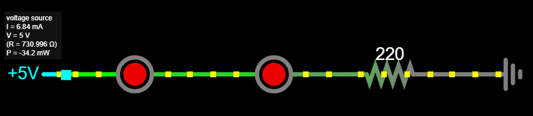
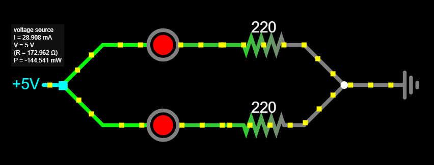

# Vooluahelad

**Elektriahel** (ingl *electrical circuit*) ehk **vooluahel** on aktiiv- ja passiivelementide kogum, milles võib kulgeda elektrivool.
Elektriahela ühesuguse vooluga osa on **haru**.
Vooluahel võib koosneda ühest või mitmest jada- ja rööpühenduses elementidega harust.

**Jadaühendus** ehk järjestikühendus on elektriahela elementide niisugune ühendamisviis, mille puhul kõiki elemente läbib üks ja seesama vool; seega on voolutugevus kõigis elementides ühesuurune.

**Rööpühendus** ehk paralleelühendus on elektriahela elementide niisugune ühendamisviis, mille puhul kõigile elementidele on rakendatud üks ja seesama pinge.

## Jadaühendus

Jadamisi ühendatud elemente (1, 2, ... n) läbib ühetugevune vool:

$I=I_1=I_2=...=I_n$

Jadamisi ühendatud elementidele langevate pingete summa võrdub toitepingega:

$U=U_1+U_2+...+U_n$

Jadamisi ühendatud elementide kogutakistus on võrdne ahela elementide takistuste summaga:

$R=R_1+R_2+...+R_n$

**Omadused:**
* Vool on sama kõigis komponentides.
* Pinge jaguneb komponentide vahel.
* Kui üks komponent katkeb, lakkab kogu ahel töötamast.

### Näide: Kaks LED-i jadaühenduses
Kui ühendame kaks LED-i järjestikku Arduino 5V väljundiga:

$U_{kokku} = U_1 + U_2$

Kui iga LED vajab 1.75V, siis:

$U_{kokku} = 1.75V + 1.75V = 3.5V$

Kui kasutame 220Ω takistit, saame voolutugevuse:

$I = \frac{5V - 3.5V}{220\Omega} \approx 6.8mA$

[Vaata Falstad simulatsioonikeskkonnas](https://falstad.com/circuit/circuitjs.html?ctz=CQAgjCAMB0l3BWcMBMcUHYMGZIA4UA2ATmIxAUgpABZsKBTAWjDACgAncMFcQqsBkJ8qVFGjZhCvJngH8+IkLwAmDAGYBDAK4AbAC5NdDFeCjmYkdlN5SlrWwtUadBoybOiosdgCUQsvJULDxKXjRUSF4wCGwA5uBCSuI0YVBsQA)

## Rööpühendus

Vool rööpahela mittehargnevas osas on võrdne ahela harusid läbivate voolude summaga:

$I=I_1+I_2+...+I_n$

Rööbiti ühendatud elementidele langeb ühsugune pinge:

$U=U_1=U_2=...=U_n$

Rööbiti ühnedatud elementide kogutakistuse pöördväärtus on võrdne elementide takistuste pöördväärtuste summaga

$\frac{1}{R}=\frac{1}{R_1}+\frac{1}{R_2}+...+\frac{1}{R_n}$

**Omadused:**
* Pinge on sama kõigis harudes.
* Vool jaguneb harude vahel.
* Kui üks komponent katkeb, jäävad teised tööle.

### Näide: Kaks LED-i rööpühenduses
Kui ühendame kaks LED-i paralleelselt Arduino 5V väljundiga, on pinge mõlemale LED-ile 5V.

Kui iga LED vajab 1.75V ja kasutame 220Ω takistit iga LED-i juures:

$I = \frac{5V - 1.75V}{220\Omega} \approx 14.7mA$

Kogu vool on LED-ide voolude summa:

$I_{kokku} = 14.7mA + 14.7mA \approx 29mA$

[Vaata Falstad simulatsioonikeskkonnas](https://falstad.com/circuit/circuitjs.html?ctz=CQAgjCAMB0l3BWcMBMcUHYMGZIA4UA2ATmIxAUgpABZsKBTAWjDACgAncMFEFFGuAyE+AqKMhswhXtNGDWvfoN4ATBgDMAhgFcANgBcmehqvDiqMSO2myR0qovCEqazbsPHT5y1FjsAJRAWe2JeJho8cDCLWiokXxgENgBzPnxopQRQ3ktObjtHYWdffkkAdyF7F3SosBiKqvlazKg2SpDWuQc2ju6YuWU2oA)