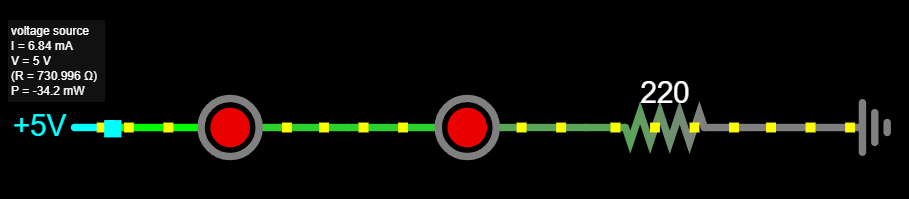
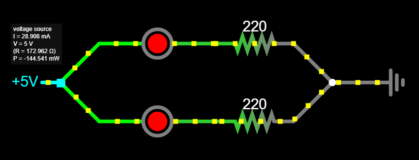

# Vooluahelad

Elektriahel ehk vooluahel koosneb omavahel ühendatud elektrilistest komponentidest ja juhtmetest. Voolu liikumiseks peab vooluahel olema suletud ning selles peab olema pingeallikas.

Vooluahelas võivad olla näiteks:

* pingeallikas, näiteks patarei või Arduino 5 V toiteviik;
* tarbijad, näiteks LED-id, takistid ja mootorid;
* ühendusjuhtmed;
* lülitid ja muud juhtimiseks kasutatavad komponendid.

**Vooluahela haru** on üks voolu liikumise tee kahe hargnemispunkti vahel. Ühe haru kõiki järjestikku ühendatud komponente läbib sama tugevusega vool.

**Jadaühenduse** korral on komponendid ühendatud üksteise järel samasse harusse. Kõiki jadamisi ühendatud komponente läbib sama tugevusega vool.

**Rööpühenduse** korral on komponendid või komponentide rühmad ühendatud eraldi harudesse. Kõigile rööbiti ühendatud harudele rakendub sama pinge.

Vooluahel võib sisaldada korraga nii jada- kui ka rööpühendusi.

## Jadaühendus

Jadamisi ühendatud komponendid asuvad samas harus ja neid läbib sama tugevusega vool:

$$I = I_1 = I_2 = \ldots = I_n$$

Komponentidele langevate pingete summa võrdub toitepingega:

$$U = U_1 + U_2 + \ldots + U_n$$

Jadamisi ühendatud takistite kogutakistus võrdub üksikute takistuste summaga:

$$R = R_1 + R_2 + \ldots + R_n$$

Jadaühenduse omadused:

* kõiki komponente läbib sama tugevusega vool;
* toitepinge jaguneb komponentide vahel;
* takistite lisamisel kogutakistus suureneb;
* kui üks komponent või ühendus katkeb, lakkab kogu ahel töötamast.

### Näide: kaks LED-i jadaühenduses

Simulatsiooninäites ühendatakse 5 V toiteallikaga jadamisi kaks punast LED-i ja 220 Ω takisti.

Simulaatori kasutatud LED-i mudelis on ühe LED-i päripinge selle voolutugevuse juures ligikaudu 1,75 V. Kahe LED-i pingelang kokku on:

$$U_{\mathrm{LED}} = 1{,}75\ \mathrm{V} + 1{,}75\ \mathrm{V} = 3{,}5\ \mathrm{V}$$

Takistile jääv pinge on:

$$U_R = 5\ \mathrm{V} - 3{,}5\ \mathrm{V} = 1{,}5\ \mathrm{V}$$

Ahelat läbiv voolutugevus on:

$$I = \frac{1{,}5\ \mathrm{V}}{220\ \Omega} \approx 0{,}0068\ \mathrm{A} = 6{,}8\ \mathrm{mA}$$

Arvutatud 6,8 mA vool läbib nii takistit kui ka mõlemat LED-i. See jääb alla [UNO R4 WiFi andmelehes](https://docs.arduino.cc/resources/datasheets/ABX00087-datasheet.pdf) märgitud 8 mA I/O-viigu voolupiiri.

[Vaata jadaühendust Falstad Circuit Simulatoris](https://falstad.com/circuit/circuitjs.html?ctz=CQAgjCAMB0l3BWcMBMcUHYMGZIA4UA2ATmIxAUgpABZsKBTAWjDACgAncMFcQqsBkJ8qVFGjZhCvJngH8+IkLwAmDAGYBDAK4AbAC5NdDFeCjmYkdlN5SlrWwtUadBoybOiosdgCUQsvJULDxKXjRUSF4wCGwA5uBCSuI0YVBsQA)

## Rööpühendus

Rööbiti ühendatud harudele rakendub sama pinge:

$$U = U_1 = U_2 = \ldots = U_n$$

Ahela mittehargnevat osa läbiv koguvool võrdub harude voolude summaga:

$$I = I_1 + I_2 + \ldots + I_n$$

Rööbiti ühendatud takistite kogutakistus arvutatakse valemiga:

$$\frac{1}{R} = \frac{1}{R_1} + \frac{1}{R_2} + \ldots + \frac{1}{R_n}$$

Rööpühenduse omadused:

* kõigile harudele rakendub sama pinge;
* koguvool jaguneb harude vahel;
* uue rööpharu lisamisel kogutakistus väheneb;
* ühe haru katkemisel saavad teised harud edasi töötada.

### Näide: kaks LED-i rööpühenduses

Simulatsiooninäites ühendatakse kaks LED-i eraldi rööpharudesse. Mõlemas harus on LED-iga jadamisi ühendatud oma 220 Ω takisti.

**Igal rööbiti ühendatud LED-il peab olema oma voolu piirav takisti.** Ühe ühise takisti kasutamisel ei pruugi vool LED-ide vahel võrdselt jaguneda.

Mõlemale harule rakendub pinge 5 V. Kui ühe LED-i päripinge on simulaatori mudelis ligikaudu 1,8 V, siis ühe haru voolutugevus on:

$$I_{\mathrm{haru}} = \frac{5\ \mathrm{V} - 1{,}8\ \mathrm{V}}{220\ \Omega} \approx 14{,}5\ \mathrm{mA}$$

Kahe ühesuguse haru koguvool on:

$$I_{\mathrm{kokku}} = 14{,}5\ \mathrm{mA} + 14{,}5\ \mathrm{mA} \approx 29\ \mathrm{mA}$$

Seda simulatsiooniahelat toidetakse 5 V toiteallikast, mitte Arduino I/O-viigust. Ligikaudu 29 mA koguvool ületab nii UNO R3 ühe I/O-viigu 20 mA piiri kui ka UNO R4 WiFi 8 mA piiri. Kui mõlemat LED-i soovitakse juhtida ühe Arduino viiguga, tuleb kasutada transistorit või muud sobivat draiverit.

[Vaata rööpühendust Falstad Circuit Simulatoris](https://falstad.com/circuit/circuitjs.html?ctz=CQAgjCAMB0l3BWcMBMcUHYMGZIA4UA2ATmIxAUgpABZsKBTAWjDACgAncMFEFFGuAyE+AqKMhswhXtNGDWvfoN4ATBgDMAhgFcANgBcmehqvDiqMSO2myR0qovCEqazbsPHT5y1FjsAJRAWe2JeJho8cDCLWiokXxgENgBzPnxopQRQ3ktObjtHYWdffkkAdyF7F3SosBiKqvlazKg2SpDWuQc2ju6YuWU2oA)

LED on diood. Dioodidest räägitakse täpsemalt [Arduino baaselementide õppematerjalis](https://github.com/nullyks/Arduino-baaselemendid/blob/main/materjalid/2_dioodid.md).

---

[Eelmine: elektrivõimsus](2_võimsus.md) · [Sisukord](README.md) · [Järgmine: multimeetri kasutamine](4_multimeetri_kasutamine.md)
