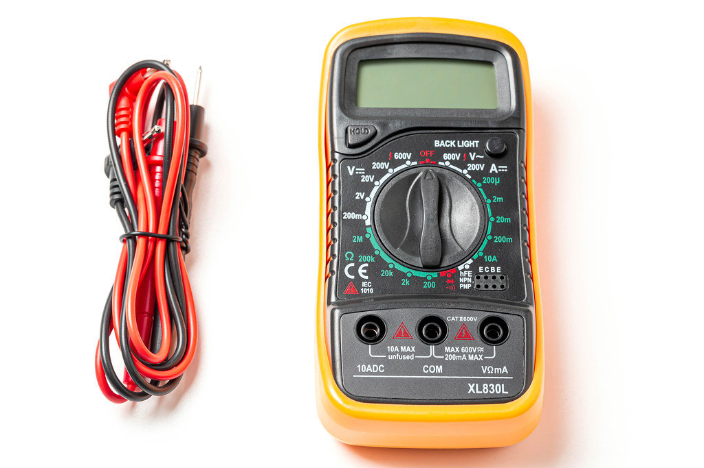
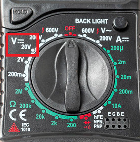
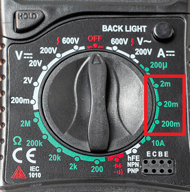
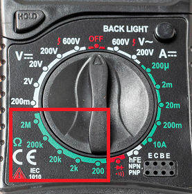

# Multimeetri kasutamine

*"Pilt: CCNull – Multimeter with probes on white. Allikas: https://ccnull.de/foto/multimeter-with-probes-on-white/1016421"*

## Ohutusnõuded
* Enne mõõtmiste alustamist veendu, et mõõdetav komponent või vooluahel on õigesti valitud.
* Takistuse mõõtmisel veendu, et vooluahel on vooluta.
* Voolu tugevuse mõõtmisel ära ühenda testjuhtmeid otse vooluallika toiteklemmidele – see võib kahjustada multimeetrit.
* Veendu, et multimeetri testjuhtmete isolatsioon on terve.

## Alalisvoolu pinge mõõtmine
Pinget mõõdetakse mõõdetava komponendi suhtes paralleelselt.
Punane testjuhe vooluallika plussi poole ja must juhe vooluallika miinuse poole.

Multimeeter seadista alalisvoolu pinge mõõtmise režiimi valides eeldatava kõrgeima võimaliku pinge (NB! mõned multimeetrid tuvastavad vahemiku automaatselt). Näiteks Arduino põhiste seadmet puhul on tavapärane 20V - vt. pildilt:

## Alalisvoolu tugevuse mõõtmine
Voolutugevuse mõõtmiseks tuleb multimeeter ühendada vooluahelasse jadamisi.
Pole oluline, kas ühendada multimeeter enne või pärast tarbijat.

Multimeeter seadista alalisvoolu tugevuse mõõtmise režiimi valides eeldatava kõrgeima võimaliku voolutugevuse (NB! mõned multimeetrid tuvastavad vahemiku automaatselt). Arduino põhiste seadmete puhul võib see olla 2-200 mA - vt. pildilt:

## Takistuse mõõtmine
Parima tulemuse saad kui ühendad mõõdetava komponendi lahti.
Kui komponenti ei saa lahti ühendada, siis tuleb vähemalt toide välja lülitada.

Multimeeter seadista takistuse mõõtmise režiimi valides eeldatava kõrgeima võiamliku takistuse (NB! mõned multimeetrid tuvastavad vahemiku automaatselt). Vt. pildilt:

