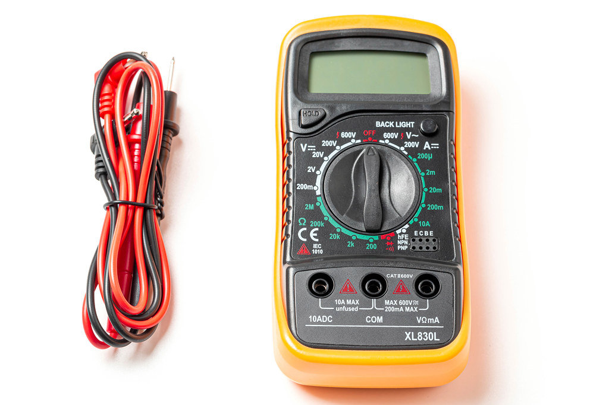
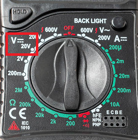
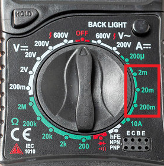
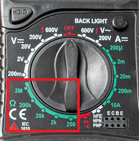

# Multimeetri kasutamine

*Foto: CCNull, [„Multimeter with probes on white”](https://ccnull.de/foto/multimeter-with-probes-on-white/1016421).*

Multimeetriga saab mõõta näiteks pinget, voolutugevust ja takistust. Enne mõõtmist tuleb valida õige mõõterežiim, mõõtepiirkond ja testjuhtmete ühenduspesad.

Selles õppematerjalis mõõdetakse ainult Arduino madalpingelisi alalisvooluahelaid. Multimeetrit ei kasutata elektrivõrgu pinge ega teiste kõrgete pingete mõõtmiseks.

## Ohutusnõuded

* Kontrolli enne mõõtmist, et multimeeter ja testjuhtmete isolatsioon oleksid terved.
* Ühenda must testjuhe alati pesaga **COM**.
* Pinge, takistuse ja ühenduse pidevuse mõõtmisel ühenda punane testjuhe pesaga **VΩ**.
* Voolutugevuse mõõtmisel ühenda punane testjuhe mõõdetavale voolule vastava **mA**- või **10 A**-pesaga. Pesade tähised ja lubatud piirid võivad multimeetritel erineda.
* Kui mõõdetava voolu suurus ei ole teada, alusta multimeetri suurimast lubatud voolupiirkonnast ja liigu vajaduse korral väiksema piirkonna juurde.
* Lülita vooluahela toide enne testjuhtmete või komponentide ümberühendamist välja.
* Ära ühenda voolumõõtmise režiimis multimeetrit otse toiteallika pluss- ja miinusklemmide vahele. Selline ühendus tekitab lühise ning võib kahjustada multimeetrit või toiteallikat.
* Mõõda takistust ainult pingestamata vooluahelas. Võimaluse korral eemalda mõõdetav komponent vooluahelast.
* Pärast voolutugevuse mõõtmist tõsta punane testjuhe tagasi **VΩ**-pessa. Nii väldid järgmisel pingemõõtmisel juhuslikku lühist.
* Ära ületa multimeetri pesadele ja mõõtepiirkondadele märgitud suurimaid lubatud väärtusi.

## Alalispinge mõõtmine

Pinge näitab kahe punkti elektrilise potentsiaali erinevust. Seetõttu mõõdetakse pinget vooluahela kahe punkti või komponendi klemmide vahel ehk rööbiti.

Alalispinge mõõtmiseks:

1. Ühenda must testjuhe multimeetri **COM**-pessa.
2. Ühenda punane testjuhe **VΩ**-pessa.
3. Vali alalispinge mõõterežiim, mille tähis on tavaliselt **V⎓** või **V=**.
4. Kui multimeeter ei vali mõõtepiirkonda automaatselt, vali väikseim piirkond, mis on eeldatavast pingest suurem. Arduino 5 V ahela mõõtmiseks sobib näiteks 20 V piirkond.
5. Lülita mõõdetav vooluahel sisse.
6. Ühenda must testotsik vooluahela GND-poolega ja punane testotsik mõõdetava punktiga.
7. Loe pinge multimeetri ekraanilt.

Pinge mõõtmiseks ei katkestata vooluahelat. Testotsikud ühendatakse mõõdetava komponendi või ahelaosaga rööbiti.

Kui testotsikud on vahetuses, kuvab digitaalne multimeeter tavaliselt õige arvväärtuse ees miinusmärgi.

## Alalisvoolutugevuse mõõtmine

Voolutugevuse mõõtmiseks peab kogu mõõdetava haru vool läbima multimeetrit. Seetõttu katkestatakse vooluahel mõõtekohas ja multimeeter ühendatakse ahelasse jadamisi.

Alalisvoolutugevuse mõõtmiseks:

1. Lülita vooluahela toide välja.
2. Ühenda must testjuhe multimeetri **COM**-pessa.
3. Kui voolutugevus ei ole teada, ühenda punane testjuhe esmalt suurima voolu mõõtmiseks mõeldud pessa, mille tähis on tavaliselt **10 A**.
4. Vali alalisvoolutugevuse mõõterežiim, mille tähis on tavaliselt **A⎓** või **A=**, ning alusta suurimast mõõtepiirkonnast.
5. Katkesta vooluahel soovitud mõõtekohas.
6. Ühenda multimeeter katkestatud ahelasse jadamisi nii, et kogu mõõdetava haru vool läbiks multimeetrit.
7. Lülita vooluahel sisse ja loe näit.
8. Kui näit on mA-pesa jaoks piisavalt väike, lülita toide välja, tõsta punane testjuhe mA-pessa, vali sobiv väiksem mõõtepiirkond ja korda mõõtmist.
9. Pärast mõõtmist lülita toide välja, eemalda multimeeter ahelast ja taasta vooluahela ühendus.
10. Tõsta punane testjuhe tagasi **VΩ**-pessa.

Tähis **200 m** tähendab näiteks, et selle piirkonna suurim mõõdetav vool on 200 mA. Pesa ja mõõtepiirkonna lubatud väärtust ei tohi ületada.

**Ära ühenda voolumõõtmise režiimis multimeetrit rööbiti pingeallika või komponendiga.** Multimeetri voolusisendi takistus on väga väike ja selline ühendus tekitab lühise.

## Takistuse mõõtmine

Takistuse mõõtmisel tekitab multimeeter ise väikese mõõtevoolu. Seetõttu peab mõõdetav vooluahel olema täielikult pingestamata.

Takistuse mõõtmiseks:

1. Lülita vooluahela toide välja ning eemalda USB-kaabel, patarei või muu toiteallikas.
2. Võimaluse korral eemalda mõõdetav komponent vooluahelast. Kui see ei ole võimalik, ühenda vähemalt üks komponendi jalg ahelast lahti.
3. Ühenda must testjuhe **COM**-pessa.
4. Ühenda punane testjuhe **VΩ**-pessa.
5. Vali takistuse mõõterežiim **Ω**.
6. Kui multimeeter ei vali mõõtepiirkonda automaatselt, vali väikseim piirkond, mis on eeldatavast takistusest suurem. Näiteks 470 Ω takisti mõõtmiseks sobib 2 kΩ piirkond.
7. Aseta testotsikud komponendi kahe klemmi vastu ja loe tulemus ekraanilt.

Kui ekraanil kuvatakse **OL**, **1** või muu ülepiirkonna tähis, vali suurem mõõtepiirkond. Nullilähedane näit tähendab väga väikest takistust või peaaegu otsest ühendust.

## Ühenduse pidevuse kontroll

Ühenduse pidevuse kontroll aitab leida katkiseid juhtmeid, halbu ühendusi ja soovimatuid lühiseid.

1. Veendu, et vooluahel oleks pingestamata.
2. Ühenda testjuhtmed pesadesse **COM** ja **VΩ**.
3. Vali pidevuse kontrollimise režiim, mille juures on tavaliselt helisignaali tähis.
4. Puuduta testotsikutega kontrollitava juhtme või ühenduse kahte otsa.

Helisignaal või nullilähedane takistus tähendab, et punktide vahel on elektriline ühendus. Helisignaali puudumine tähendab tavaliselt, et ühendus on katkenud või selle takistus on multimeetri määratud piirist suurem.

---

[Eelmine: vooluahelad](3_vooluahelad.md) · [Sisukord](README.md) · [Järgmine: skeemide koostamine ja simuleerimine](5_skeemide_koostamine_ja_simuleerimine.md)
