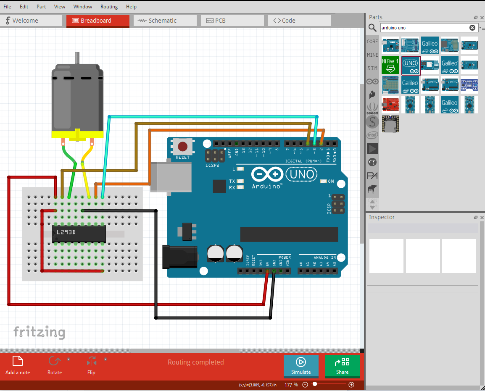
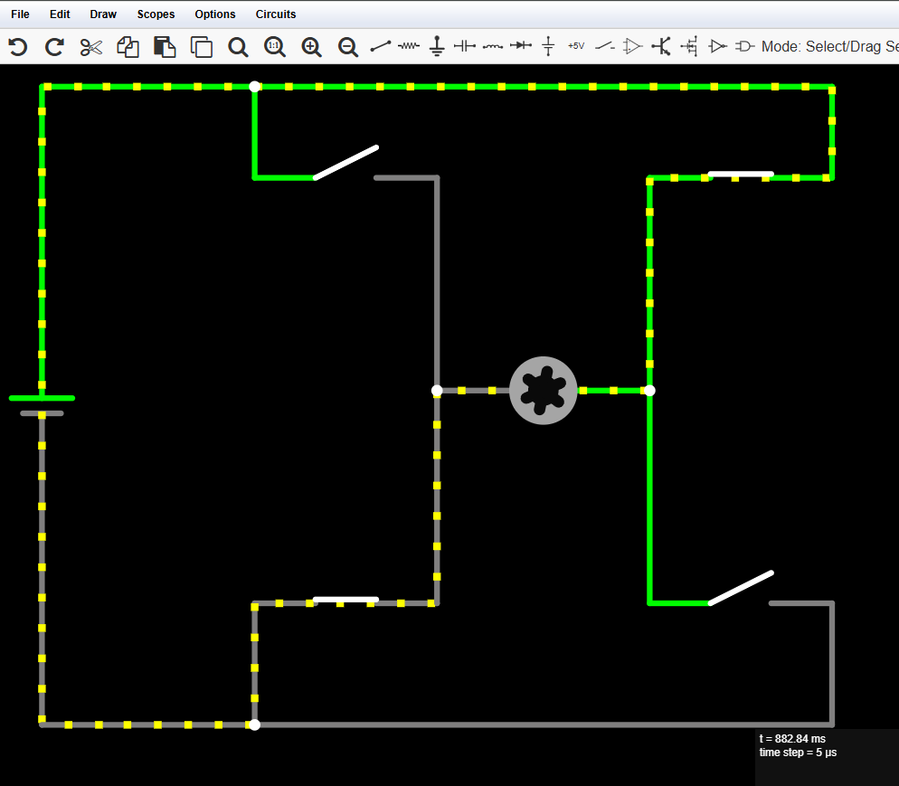
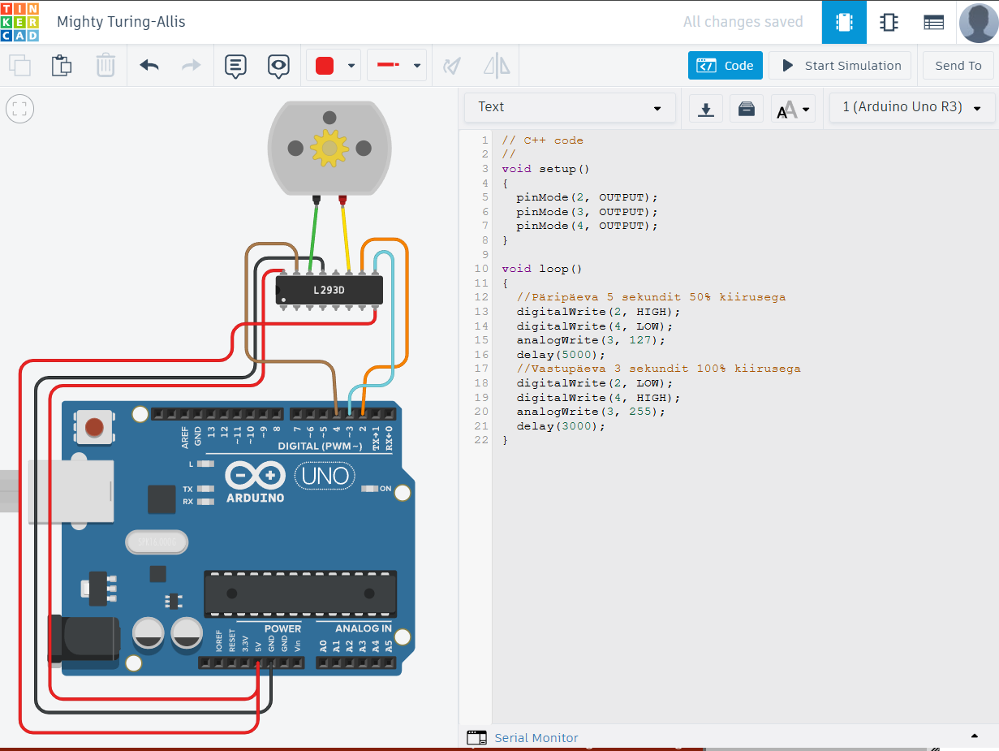

# Vooluringide skeemide koostamine ja simuleerimine

Arendusplaatidega ühendatavate vooluringide planeerimisel on kasulik need eelnevalt üles joonistada. See aitab kaasa nii planeerimisele võimaldades märgata ja parandada vigu, kui ka hilisemale dokumenteerimisele, sest ükski elektroonikaprojekt pole täielik ilma joonisteta.
Mitmed vahendid ja keskkonnad lubavad lisaks jooniste koostamisele ka vooluringide tööd simuleerida tehes ära vajalikud arvutused ja demonstreerides, kuidas vool vooluringis olevaid elemente läbib ja mis on selle tulemus. 

Kasulikud vahendid arendusplaatide jaoks jooniste tegemisel on:

* [Fritzing tarkvara](https://fritzing.org/) - vabavaraline allalaetav tarkvara arendusplaatidega seotud jooniste tegemiseks. Tarkvara sisaldab paljusid levinud elektroonikakomponente ning võimaldab ka uusi komponente lisada. 
* [Falstad Circuit Simulator](https://falstad.com/circuit/circuitjs.html) - veebipõhine keskkond elektroonikaskeemide simuleerimiseks. Ei ole otseselt mõeldud arendusplaatide jaoks. Samas sisaldab palju elektroonika baaselemente ning visualiseerib väga hästi vooluringide toimimist. 
* [Tinkercad Circuits](https://www.tinkercad.com/dashboard/designs/circuits) - Autotesk poolt pakutav tasuta veebikeskkond, mis lubab visuaalselt koostada lihtsamaid Arduino ja Micro:bit arendusplaatidel põhinevaid seadmeid ja nende tööd ka simuleerida. Loodud projekte saab avalikustada ja teistega jagada.

## Fritzing

*"Ekraanitõmmis Fritzing tarkvarast - H-sild L293D kiibi abil"*

Fritzing on avatud lähtekoodiga tarkvara, mis on loodud elektroonikaprojektide disainimiseks ja dokumenteerimiseks. See pakub intuitiivset kasutajaliidest skeemide loomisel ja trükkplaatide kujundamisel. On populaarne kuna võimaldab kiiresti luua vooluringide visulaiseeringuid, mis sarnanevad reaalsele riistvarale. Tarkvara on saadaval Windowsi, macOS-i ja Linuxi platvormidele, pakkudes laia ligipääsetavust erinevatele kasutajatele.

Fritzing toetab kolme peamist töövaadet: makettplaadi vaade *(ingl breadboard view)*, skeemivaade *(ingl schematic view)* ja trükkplaadi vaade *(ingl Printed circuit Board (PCB) view)*. Makettplaadi vaade võimaldab kasutajatel elektroonikakomponente graafiliselt paigutada ja ühendada täpselt nii, nagu see toimuks füüsilisel makettplaadil. Skeemivaade pakub klassikalist joonisskeemi, mis on kasulik loogiliste ühenduste mõistmiseks, ning PCB vaates saab kasutaja disainida trükkplaadi paigutuse, mida on võimalik eksportida tootmiseks. Lisaks on tarkvaras suur komponentide teek, mis sisaldab erinevaid mikrokontrollereid, andureid ja teisi elektroonikakomponente.

Fritzing on kasulik tööriist nii õppe- kui ka praktiliste elektroonikaprojektide jaoks, kuna see lihtsustab prototüüpide loomist ja dokumenteerimist. Kasutajad saavad oma projekte jagada Fritzingi kogukonnas ning tarkvara toetab ka kohandatud komponentide loomist.

### Abimaterjalid
* [Kiire õpetus alustamiseks](https://fritzing.org/learning/get-started/)
* [Kasutajaliidese selgitus](https://fritzing.org/learning/full_reference)
## Falstad

*"Ekraanitõmmis Falstad keskkonnast - manuaalsete lülititega H-sild"*

Falstad Circuit Simulator on veebipõhine elektroonikaskeemide simuleerimise tööriist, mis võimaldab kasutajatel luua ja analüüsida vooluringe reaalajas. See keskkond on kasulik nii algajatele kui ka edasijõudnud elektroonikahuvilistele, kuna see pakub visuaalset ja interaktiivset lähenemist. Simulaator on saadaval tasuta ning töötab otse veebibrauseris ilma täiendava tarkvara paigaldamiseta.

Keskkond toetab laia valikut elektroonikakomponente, sealhulgas takisteid, kondensaatoreid, dioode, transistoreid ja isegi programmeeritavaid loogikakomponente. Kasutajad saavad skeeme luua lihtsa lohistamisliidese abil ning näha kohe, kuidas vooluringid toimivad. Simulatsioon kuvab pinge ja voolu muutusi dünaamiliselt, võimaldades visuaalselt jälgida näiteks kondensaatori laadumist ja tühjenemist või ostsillaatori tööd. Lisaks on võimalik kasutada erinevaid mõõtevahendeid, nagu ostsilloskoop, et analüüsida signaalide käitumist.

Falstad Circuit Simulator võimaldab õppijal katsetada ja mõista vooluringide tööpõhimõtteid riskivabalt. Samuti sisaldab keskkond mitmeid eelnevalt eelkoostatud skeeme, mida saab uurida ja kohandada vastavalt vajadusele. Simulaator toetab ka koodipõhist vooluringide kirjeldamist, mis annab edasijõudnutele võimaluse skeeme süvitsi analüüsida ja optimeerida. Tänu lihtsusele ja paindlikkusele sobib see nii hariduslikuks kasutamiseks kui ka kiireks prototüüpimiseks.

### Abimaterjalid
* [Keskkonna dokumentatsioon](https://falstad.com/circuit/doc/)

* [Käsiraamat PDF vormingus](https://www.bait-consulting.com/publications/circuit_simulator_manual.pdf)

## Tinkercad Circuits

*"Ekraanitõmmis Tinkercad keskkonnad - H-sild L293D kiibi abil koos koodiga"*

Tinkercad Circuits on veebipõhine elektroonika simuleerimise ja prototüüpimise keskkond, mis võimaldab kasutajatel luua ja testida vooluringe interaktiivselt. See on osa Tinkercad platvormist, mida haldab Autodesk. Kuna keskkond töötab otse veebibrauseris, pole vaja täiendavat tarkvara alla laadida.

Tinkercad Circuits võimaldab kasutajatel lisada ja ühendada erinevaid elektroonikakomponente, sealhulgas takisteid, LED-e, lüliteid, kondensaatoreid ja integraallülitusi. Üks selle võimsamaid funktsioone on Arduino simulaator, mis võimaldab programmeerida ja testida Arduino mikrokontrolleri käitumist otse veebikeskkonnas. Kasutajad saavad kirjutada ja käivitada C++ koodi ning vaadata reaalajas, kuidas nende programm mõjutab vooluringi toimimist. Lisaks sisaldab keskkond ostsilloskoopi ja muid mõõtevahendeid, mis aitavad analüüsida vooluringide elektrilisi omadusi.

Tinkercad Circuits on ideaalne platvorm elektroonika õppimiseks ja õpetamiseks, kuna see võimaldab kasutajatel turvalises keskkonnas katsetada ja vigadest õppida ilma füüsilise riistvara kahjustamise riskita. Keskkonnas on ka mitmeid eeldefineeritud projekte ja õpetusmaterjale, mis hõlbustavad uute kasutajate sisseelamist. 

### Abimaterjalid
* [Kiire õpetus alustamiseks](https://www.tinkercad.com/blog/official-guide-to-tinkercad-circuits)
* [Interaktiivne õppematerjal](https://www.tinkercad.com/learn/circuits)
