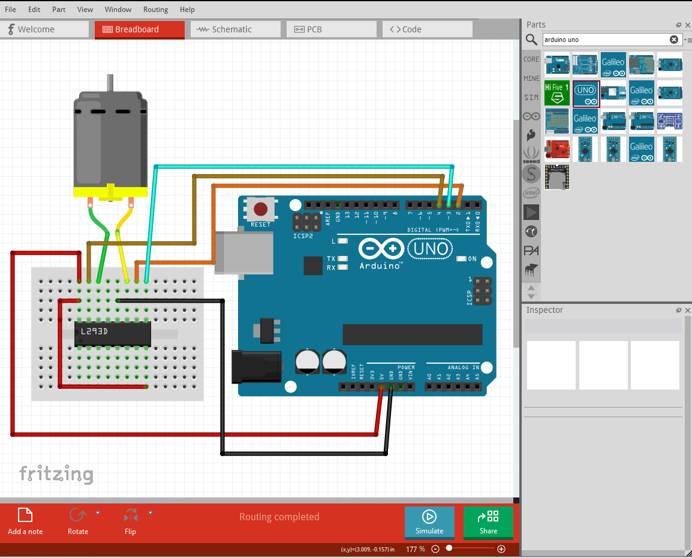
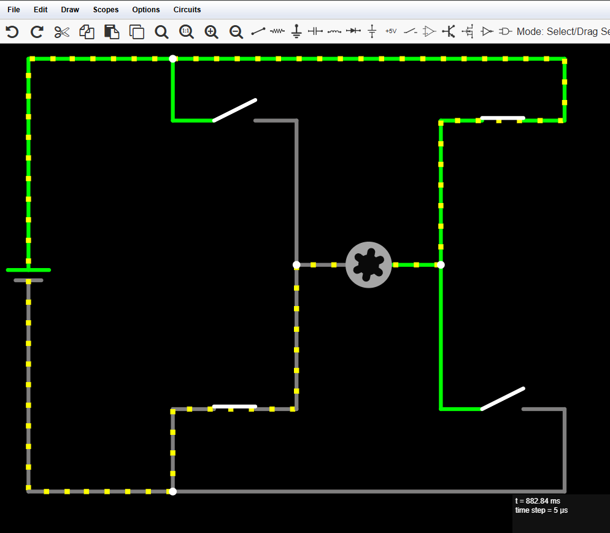
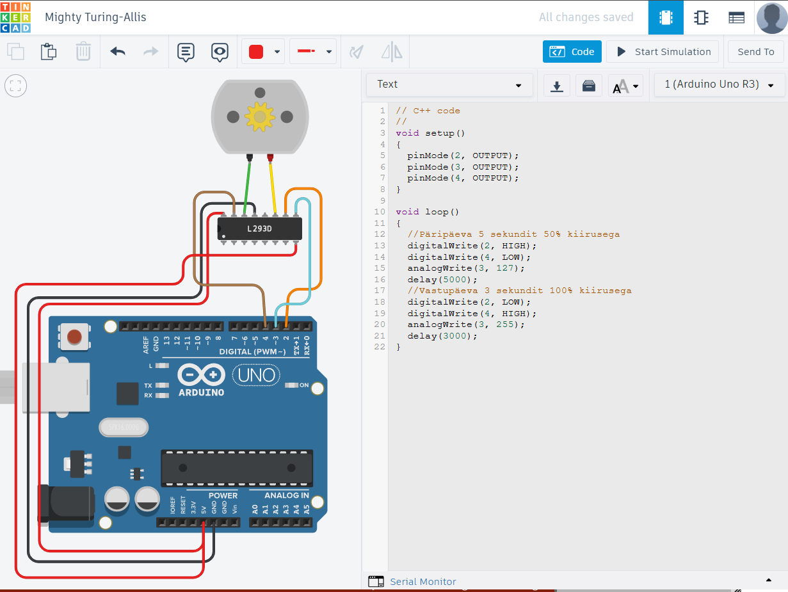

# Vooluahelate skeemide koostamine ja simuleerimine

Enne vooluahela füüsilist koostamist on kasulik teha ühendusjoonis või skeem. Joonis aitab planeerida komponentide paigutust, kontrollida ühendusi, leida vigu ning dokumenteerida valmis seadet.

Ühendusjoonis näitab komponentide füüsilist paigutust ja juhtmete ühendamist. Elektriskeem kasutab komponentide tingmärke ning näitab eelkõige nende elektrilisi ühendusi. Simulatsioon võimaldab lisaks kontrollida, kuidas koostatud vooluahel mudeli järgi töötab.

Selles õppematerjalis kasutatakse kolme tööriista:

| Tööriist | Peamine kasutus | Simulatsioon |
|---|---|---|
| [Fritzing](https://fritzing.org/) | Makettplaadi ühendusjooniste, elektriskeemide ja trükkplaadi jooniste koostamine | Ei |
| [Falstad Circuit Simulator](https://falstad.com/circuit/circuitjs.html) | Elektriskeemide koostamine ning pinge ja voolutugevuse jälgimine | Jah |
| [Tinkercad Circuits](https://www.tinkercad.com/dashboard/designs/circuits) | Arduino UNO R3 ühenduste ja programmide koostamine ning katsetamine | Jah |

Simulatsioon kasutab komponentide lihtsustatud mudeleid. Simulatsioonis töötav vooluahel ei pruugi päriselt koostatud ahelas samamoodi käituda. Enne füüsilise ahela ühendamist tuleb kontrollida komponentide polaarsust, pingeid, voolutugevusi ja võimsuspiire.

Tinkercadi näidetes kasutatakse Arduino UNO R3 plaati. Füüsiliste ahelate korral tuleb arvestada, et UNO R4 WiFi ühe I/O-viigu voolupiir on UNO R3 piirist väiksem.

## Fritzing

*Ekraanitõmmis Fritzingu tarkvarast: L293D kiibiga H-sild.*

[Fritzing](https://fritzing.org/) on Windowsis, macOS-is ja Linuxis töötav rakendus elektroonikaprojektide joonistamiseks ning dokumenteerimiseks. Fritzing ei simuleeri vooluahela tööd ega kontrolli, kas valitud pinge, voolutugevus või takisti väärtus on ohutu.

Fritzingu lähtekood on avalik, kuid ametlikult koostatud ja paigaldamiseks valmis versioon on [Fritzingu veebilehel](https://fritzing.org/download/) tasuline allalaadimine. Enne ülesande alustamist tuleb veenduda, et vajalik tarkvara on arvutisse paigaldatud.

Fritzingis on kolm peamist töövaadet:

* **makettplaadivaade** (*Breadboard*) – näitab komponentide füüsilist paigutust ja ühendusjuhtmeid;
* **skeemivaade** (*Schematic*) – näitab vooluahela elektrilisi ühendusi tingmärkide abil;
* **trükkplaadivaade** (*PCB*) – võimaldab kavandada trükkplaadi paigutust ja ühendusradasid.

### Soovituslik tööjärjekord

1. Paiguta makettplaadivaates Arduino, makettplaat ja vajalikud komponendid.
2. Määra komponentidele õiged omadused, näiteks takisti väärtus.
3. Ühenda komponendid juhtmetega.
4. Kasuta juhtmete jaoks ühtset värvisüsteemi, näiteks punast toite ja musta või sinist GND jaoks.
5. Kontrolli skeemivaates, kas elektrilised ühendused vastavad kavandatud vooluahelale.
6. Lisa joonisele komponentide nimetused ja vajalikud märkused.
7. Ekspordi valmis joonis PNG- või SVG-failina ning lisa see seadme dokumentatsiooni.

Fritzingu joonis kirjeldab kavandatud ühendusi, kuid enne vooluahela füüsilist koostamist tuleb arvutuste või simulatsiooni abil eraldi kontrollida selle elektrilist sobivust.

### Abimaterjalid

* [Fritzingu alustamisjuhend](https://fritzing.org/learning/get-started/)
* [Fritzingu kasutajaliidese kirjeldus](https://fritzing.org/learning/full_reference)

## Falstad Circuit Simulator

*Ekraanitõmmis Falstad Circuit Simulatorist: käsitsi juhitavate lülititega H-sild.*

[Falstad Circuit Simulator](https://falstad.com/circuit/circuitjs.html) on veebibrauseris töötav vooluahelate simulaator. Sellega saab koostada elektriskeeme ning jälgida komponentide pingeid, voolutugevusi ja võimsusi.

Falstad visualiseerib voolu liikumist ja pinge erinevusi. Simulatsiooni töötamise ajal saab muuta komponentide väärtusi, lülitada lüliteid ning jälgida, kuidas muudatused mõjutavad kogu vooluahelat.

Falstad sobib hästi takistite, dioodide, kondensaatorite ja transistoridega ahelate uurimiseks. See ei ole mõeldud Arduino ühendusjooniste koostamiseks ega Arduino programmide käivitamiseks.

### Soovituslik tööjärjekord

1. Ava Falstad Circuit Simulator.
2. Vali olemasolev näidisahel või koosta uus skeem.
3. Lisa vajalikud komponendid ning määra nende väärtused.
4. Kontrolli, et vooluahel oleks suletud ja sisaldaks pingeallikat.
5. Käivita simulatsioon.
6. Vaata komponentide pingeid ja voolutugevusi.
7. Võrdle simulaatori tulemusi enda arvutustega.
8. Salvesta või jaga ahelat simulaatori loodud lingi abil.

Simulaatori näidatud tulemused sõltuvad kasutatud komponentide mudelitest. Näiteks simuleeritud LED-i päripinge võib erineda päris LED-i pingest.

### Abimaterjalid

* [Falstad Circuit Simulatori ametlik dokumentatsioon](https://falstad.com/circuit/doc/)

## Tinkercad Circuits

*Ekraanitõmmis Tinkercad Circuitsist: Arduino UNO ja L293D kiibiga H-sild koos programmiga.*

[Tinkercad Circuits](https://www.tinkercad.com/dashboard/designs/circuits) on Autodeski veebikeskkond, milles saab koostada makettplaadi ühendusi, kirjutada Arduino programme ja simuleerida vooluahela tööd. Projektide salvestamiseks on vaja Tinkercadi kasutajakontot.

Tinkercadi Arduino simulaator kasutab Arduino UNO R3 mudelit. Programmi saab koostada tekstina või plokkide abil ning simulatsiooni ajal saab jälgida komponentide käitumist ja kasutada virtuaalseid mõõtevahendeid.

Tinkercad ei sisalda Arduino UNO R4 WiFi mudelit. UNO R3 jaoks koostatud programm ja viikude paigutus sobivad paljudes selle kursuse näidetes ka UNO R4 WiFi jaoks, kuid füüsilise ahela korral tuleb eraldi arvestada UNO R4 WiFi väiksema, 8 mA I/O-viigu voolupiiriga.

### Soovituslik tööjärjekord

1. Logi Tinkercadi sisse ja ava jaotis **Circuits**.
2. Loo uus vooluahel.
3. Lisa tööalale Arduino UNO R3, makettplaat ja vajalikud komponendid.
4. Määra komponentidele õiged väärtused ning ühenda need juhtmetega.
5. Ava programmiredaktor ja sisesta Arduino programm.
6. Käivita simulatsioon nupuga **Start Simulation**.
7. Jälgi vooluahela tööd ning mõõda vajaduse korral pinget, voolutugevust või takistust virtuaalse multimeetriga.
8. Peata simulatsioon enne ühenduste või komponentide muutmist.
9. Võrdle simulatsiooni tulemusi enda arvutustega.

Simulatsioon ei asenda komponentide andmelehtede ja Arduino elektriliste piiride kontrollimist. Tinkercadis töötav ühendus võib päris riistvara üle koormata.

### Abimaterjalid

* [Tinkercad Circuitsi alustamisjuhend](https://www.tinkercad.com/blog/official-guide-to-tinkercad-circuits)
* [Tinkercad Circuitsi interaktiivsed õppematerjalid](https://www.tinkercad.com/learn/circuits)

---

[Eelmine: multimeetri kasutamine](4_multimeetri_kasutamine.md) · [Sisukord](README.md) · [Järgmine: iseseisvad ülesanded](6_iseseisvad_ülesanded.md)
