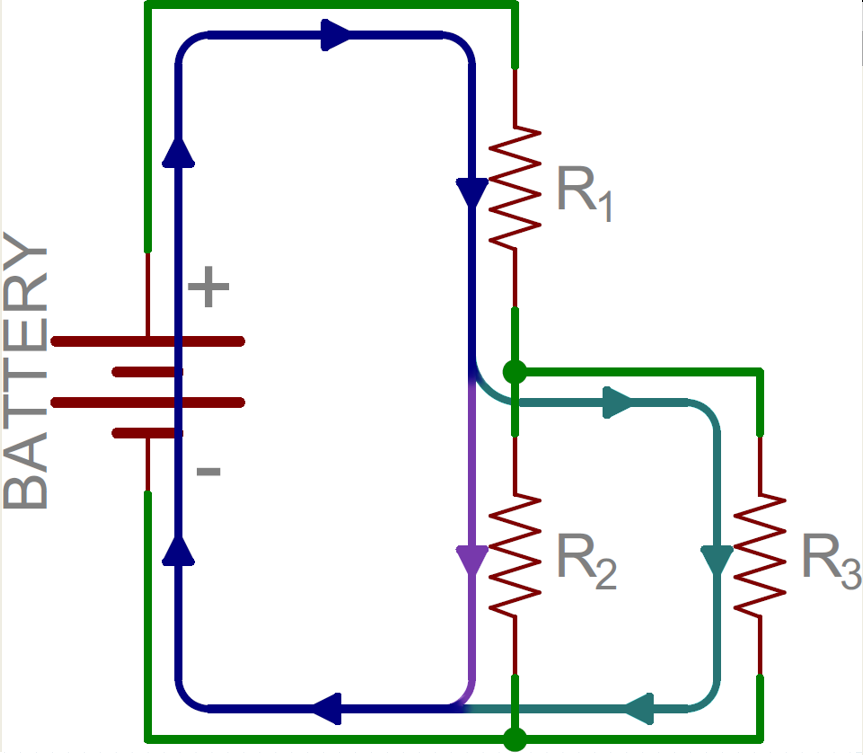

# Iseseisvad ülesanded

## Skeemi koostamine ja simuleerimine
Koosta Tinkercad Circuits keskkonnas skeem, kus Arduino UNO digitaalse viiguga 2 ja maandusviigu vahel on jadamisi ühendatud 100 $\Omega$ takisti, ja 3 punast LEDi. Digitaalse viigu 3 ja maandusviigu vahele ühenda paralleelselt 3 punast LEDi koos 100  $\Omega$ takistiga iga LEDi jaoks.
Sea programmi abil viigud 2 ja 3 väljunditeks ja pane neile pinge 5V.

Mida märkad LED-ide heleduse kohta?

Selgita miks see nii on?

[lahendus](https://www.tinkercad.com/things/8zGRN6HQs58-jada-ja-paralleel?sharecode=sUe4epPX7jZkRs-jidc_gn9qJCQEKLKdaaUtXNu6EZ8)

## Võimsuse arvutamine
Vooluallika pinge on 9V. 
Kasutaja peab jadamisi ühendatud vooluahelasse lisama 100 $\Omega$ takistust. Kas ta tohib lisada 100 $\Omega$ takisti, mille lubatud maksimumvõimsus on 1/4 W? Põhjenda oma vastust.

[Lahendus](meedia/vastus1.md)

## Voolutugevuse arvutamine
Leia millise tugevusega vool läbib takisteid $R_1, R_2$ ja $R_3$ (iga takisti kohta eraldi).

$R_1$ = 330 $\Omega$

$R_2$ = 220 $\Omega$

$R_3$ = 100 $\Omega$

$U_{battery} = 5 V$

[Abi ülesande lahendamiseks](https://www.youtube.com/watch?v=CRN5VQ86s94)

## Tulemuste kontrollimine simulatsiooni abil

Loo joonisel kujutatud vooluring Falstad Circuit veebikeskkonnas. Kontrolli, kas simulaatori poolt arvutatud väärtused kinnitavad sinu saadud tulemusi.

[Lahendus](https://falstad.com/circuit/circuitjs.html?ctz=CQAgjCAMB0l3BWcMBMcUHYMGZIA4UA2ATmIxAUgpABZsKBTAWjDACgA3EFsFEbNN1Z8whKOJpUkVGdARsATiDR5wYleBSqq2XIuX4DqjbrFUUafQPOHr-bGeSQ2AdyG81Rz87cbexww0fLxNBINd+QVMvaOCTB3c+WIieJMFU+zM2IA)

## Seadme dokumenteerimine ja loomine

Eesmärgiks on luua seade, mida saab eraldi nupust sisse/välja lülitada. Seade näitab sisselülitatuna potentsiomeetri asendit neljas vahemikus kasutades selleks LEDe.

* Pane kirja funktsionaalsed nõuded loodavale seadmele
* Pane kirja süsteemi füüsiliste komponentide loetelu
* Joonista valmis seadme skeem Fritzing tarkvaras
* Loo seade Arduino Uno abil päriselt

Edasijõudnutele:
* Modifitseeri loodud seadet nii, et potentsiomeetri nelja erineva asendi asemel näitaksid LEDid neljakümmet erinevat asendit.

[Potentsiomeetri kasutamise õpetus](https://docs.arduino.cc/learn/electronics/potentiometer-basics/)

[map funktsiooni kasutamise õpetus](https://docs.arduino.cc/language-reference/en/functions/math/map/)

[lahendus](https://www.tinkercad.com/things/ewlL0WmmW1u-neli-vahemikku?sharecode=fR5GdkA1JgncdNHTXewElXwrDL9GFkoGNkQaUZNIk9s)