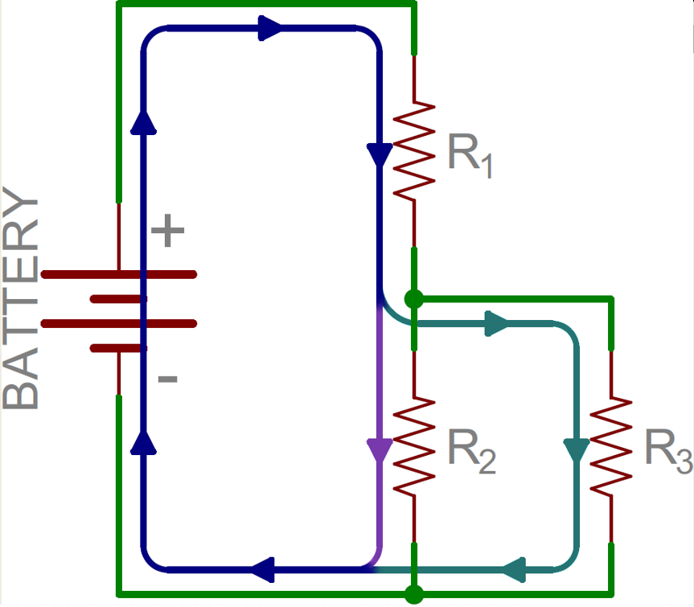

# Iseseisvad ülesanded

Need ülesanded aitavad kontrollida ja kinnistada eelnevates peatükkides õpitut. Arvutusülesannetes esita valemid, arvutuskäik, ühikud ja lõppvastus. Praktilistes ülesannetes lisa ühendusjoonis või skeem ning kirjelda saadud tulemust.

## 1. Jada- ja rööpühenduse võrdlemine

Koosta Tinkercad Circuitsis kaks vooluahelat. Arduino UNO R3 kasutatakse selles ülesandes ainult 5 V toiteallikana; Arduino programmi ei ole vaja.

### Ahel A: jadaühendus

Ühenda Arduino 5 V ja GND vahele jadamisi:

* üks 470 Ω takisti;
* kaks punast LED-i.

Kontrolli LED-ide polaarsust. LED-i anood ühendatakse 5 V poole ja katood GND poole.

### Ahel B: rööpühendus

Ühenda Arduino 5 V ja GND vahele kaks rööpharu. Mõlemas harus ühenda jadamisi:

* üks 470 Ω takisti;
* üks punane LED.

Igal LED-il peab olema oma takisti.

### Ülesanne

1. Arvuta enne simulatsiooni mõlema ahela eeldatav voolutugevus. Kasuta punase LED-i ligikaudse päripingena 2 V.
2. Ennusta, kummas ahelas põlevad LED-id eredamalt.
3. Käivita simulatsioon ja vaatle LED-ide heledust.
4. Mõõda virtuaalse multimeetriga:
   * jadaahela voolutugevus;
   * kummagi rööpharu voolutugevus;
   * rööpahela koguvool.
5. Võrdle mõõdetud tulemusi enda arvutustega.
6. Selgita:
   * miks on jadaahela LED-id rööpahela LED-idest erineva heledusega;
   * miks vajab rööpahela iga LED eraldi takistit;
   * mis juhtub teise LED-iga, kui üks rööpharu katkestada.

Esita tulemused tabelina:

| Mõõdetav suurus | Arvutatud väärtus | Simulatsioonis mõõdetud väärtus |
|---|---:|---:|
| Jadaahela voolutugevus |  |  |
| Esimese rööpharu voolutugevus |  |  |
| Teise rööpharu voolutugevus |  |  |
| Rööpühenduse koguvool |  |  |

Pärast simulatsioonis kontrollimist võib sama vooluahela õpetaja loal füüsiliselt koostada.

## 2. Takisti võimsuse valimine

100 Ω takisti ühendatakse otse 9 V alalisvooluallikaga.

1. Arvuta takistit läbiv voolutugevus.
2. Arvuta takistis hajuv võimsus.
3. Kontrolli tulemust kahe erineva valemiga:

   $$P = U \cdot I$$

   $$P = \frac{U^2}{R}$$
4. Kas selles ahelas võib kasutada 0,25 W nimivõimsusega takistit? Põhjenda vastust.
5. Millise nimivõimsusega takisti valiksid, kui ahel peab töötama pikemat aega? Arvesta, et takistit ei ole soovitatav kasutada pidevalt selle suurima lubatud võimsuse piiril.

[Lahendus](meedia/vastus1.md)

## 3. Voolutugevuse arvutamine segavooluahelas

Joonisel on takisti $R_1$ ühendatud jadamisi rööpühendusega, mille moodustavad takistid $R_2$ ja $R_3$.

**Antud:**

* $R_1 = 330\ \Omega$
* $R_2 = 220\ \Omega$
* $R_3 = 100\ \Omega$
* $U = 5\ \mathrm{V}$

Leia:

1. takistite $R_2$ ja $R_3$ rööpühenduse kogutakistus;
2. kogu vooluahela kogutakistus;
3. takistit $R_1$ läbiv voolutugevus;
4. takistile $R_1$ langev pinge;
5. rööpühendusele langev pinge;
6. takistit $R_2$ läbiv voolutugevus;
7. takistit $R_3$ läbiv voolutugevus.

Kontrolli, et rööpharude voolutugevuste summa võrduks takistit $R_1$ läbiva voolutugevusega:

$$I_1 = I_2 + I_3$$

Esita kõik arvutuskäigud ja vastused sobivate ühikutega.

[Ingliskeelne abivideo jada-rööpahela arvutamise kohta](https://www.youtube.com/watch?v=CRN5VQ86s94)

[Lahendus](meedia/vastus2.md)

## 4. Arvutuste kontrollimine simulatsiooniga

Koosta eelmises ülesandes kujutatud vooluahel Falstad Circuit Simulatoris.

Kasuta järgmisi väärtusi:

* pingeallikas: 5 V;
* $R_1 = 330\ \Omega$;
* $R_2 = 220\ \Omega$;
* $R_3 = 100\ \Omega$.

### Ülesanne

1. Koosta skeem nii, et $R_1$ oleks jadamisi takistite $R_2$ ja $R_3$ rööpühendusega.
2. Käivita simulatsioon.
3. Kontrolli simulaatori abil:
   * kogu vooluahela voolutugevust;
   * takistit $R_1$ läbivat voolutugevust;
   * takistit $R_2$ läbivat voolutugevust;
   * takistit $R_3$ läbivat voolutugevust;
   * takistile $R_1$ langevat pinget;
   * rööpühendusele langevat pinget.
4. Võrdle simulaatori näite eelmises ülesandes saadud arvutustega.
5. Kontrolli, et rööpharude voolude summa võrduks takistit $R_1$ läbiva vooluga.
6. Selgita lühidalt, miks võivad ümardatud arvutustulemused simulaatori näitudest veidi erineda.

Esita tulemused tabelina:

| Mõõdetav suurus | Arvutatud väärtus | Simulaatori väärtus |
|---|---:|---:|
| $I_1$ |  |  |
| $I_2$ |  |  |
| $I_3$ |  |  |
| $U_1$ |  |  |
| $U_{23}$ |  |  |

[Lahendus Falstad Circuit Simulatoris](https://falstad.com/circuit/circuitjs.html?ctz=CQAgjCAMB0l3BWcMBMcUHYMGZIA4UA2ATmIxAUgpABZsKBTAWjDACgA3EFsFEbNN1Z8whKOJpUkVGdARsATiDR5wYleBSqq2XIuX4DqjbrFUUafQPOHr-bGeSQ2AdyG81Rz87cbexww0fLxNBINd+QVMvaOCTB3c+WIieJMFU+zM2IA)

## 5. Potentsiomeetri asendi näidik

Loo Arduino UNO abil seade, mis näitab potentsiomeetri asendit nelja LED-iga. Seadet saab surunupu abil sisse ja välja lülitada.

### Töö etapid

1. Pane kirja seadme funktsionaalsed nõuded.
2. Koosta kasutatavate komponentide ja nende väärtuste loetelu.
3. Koosta seadme ühendusjoonis Fritzingis. Märgi joonisele viigud ja takistite väärtused.
4. Kirjuta kommenteeritud Arduino programm.
5. Kontrolli ühendust ja programmi Tinkercad Circuitsis. Tinkercadis kasuta Arduino UNO R3 plaati.
6. Lase õpetajal ühendusjoonis üle kontrollida.
7. Koosta seade füüsiliselt Arduino UNO R3 või UNO R4 WiFi abil.
8. Katseta kõiki nelja potentsiomeetri vahemikku ning seadme sisse- ja väljalülitamist.
9. Dokumenteeri katsetamise tulemused.

### Edasijõudnutele

Muuda programmi nii, et neli LED-i näitaksid potentsiomeetri asendit kahendarvuna vahemikus 0–15. Näiteks:

* 0 = 0000;
* 5 = 0101;
* 10 = 1010;
* 15 = 1111.

Jaga potentsiomeetri analoogväärtused kuueteistkümneks vahemikuks ja kuva vastava vahemiku number LED-idel kahendkujul.

### Abimaterjalid

* [Potentsiomeetri kasutamise õpetus](https://docs.arduino.cc/learn/electronics/potentiometer-basics/)
* [`map()`-funktsiooni kasutamise õpetus](https://docs.arduino.cc/language-reference/en/functions/math/map/)

[Näidislahendus](meedia/vastus3.md)

---

[Eelmine: skeemide koostamine ja simuleerimine](5_skeemide_koostamine_ja_simuleerimine.md) · [Sisukord](README.md)
